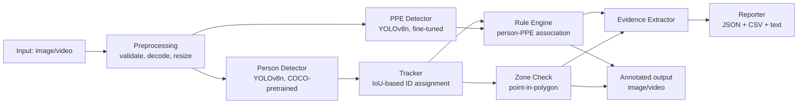

# System Architecture

## Pipeline

## Why two detectors instead of one

A single fine-tuned model *could* detect person+helmet+head together (the
Kaggle dataset even has a `person` class). We deliberately use two models:

- **Person detector** = stock COCO-pretrained YOLOv8n. General-purpose,
  robust across scenes, and honestly attributable as "not trained by us."
- **PPE detector** = YOLOv8n fine-tuned on 5000 images of head/helmet crops.
  A specialist, smaller-vocabulary model trained on a small dataset
  generalizes better to *that specific sub-task* than folding it into one
  do-everything model would, and keeps `PersonDetector` swappable
  independently of the PPE model (e.g. to a bigger COCO model) without
  retraining PPE detection.

This is a documented, defensible trade-off, not an attempt to look more
complex than the dataset actually supports.

## Module responsibilities

| Module | File | Responsibility |
|---|---|---|
| Preprocessing | `src/preprocessing/processor.py` | File I/O, validation, frame extraction, resize |
| Detection | `src/detection/detector.py` | YOLO inference wrappers, model loading errors |
| Tracking | `src/tracking/tracker.py` | Greedy IoU multi-object tracking |
| Safety rules | `src/safety/rule_engine.py`, `src/safety/zones.py` | Detection → decision logic |
| Evidence | `src/evidence/extractor.py` | Annotated frame capture + metadata record |
| Reporting | `src/reporting/reporter.py` | Aggregation, JSON/CSV/text output |
| Config | `src/config.py` | Validated run configuration, zone loading |
| CLI | `src/main.py` | Argument parsing, orchestration |

Each module depends only on plain dataclasses/tuples from the modules
"below" it in the table — the rule engine, for example, never imports
`ultralytics` and can be fully unit-tested with synthetic bounding boxes
(see `tests/test_rules.py`).

## Detection vs. Inference vs. Rule-based decision

The assignment requires this distinction to be explicit:

- **Detection** — what the model directly outputs: a bounding box, a class
  name (`helmet`/`head`/`person`), a confidence score. Nothing more.
- **Inference** — the spatial reasoning step in `rule_engine.py` that
  *associates* a PPE detection with a specific person via head-region
  containment. This is where "a helmet exists somewhere in the frame"
  becomes "this specific person is wearing a helmet."
- **Rule-based decision** — the final `ViolationType` assigned from that
  association: `NO_HELMET` (positive bare-head evidence, higher confidence)
  vs. `NO_HELMET_UNVERIFIED` (absence of any head-region detection — weaker
  evidence, flagged as such rather than silently treated the same).
