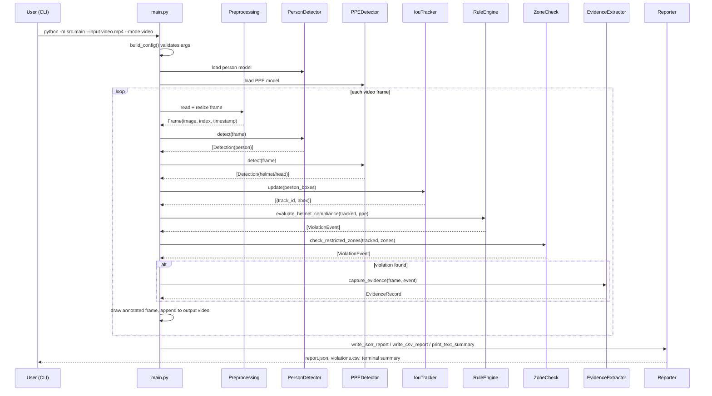
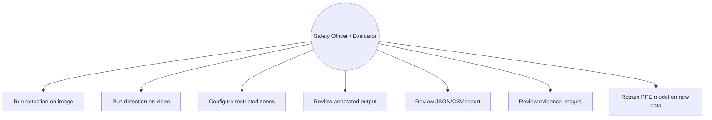
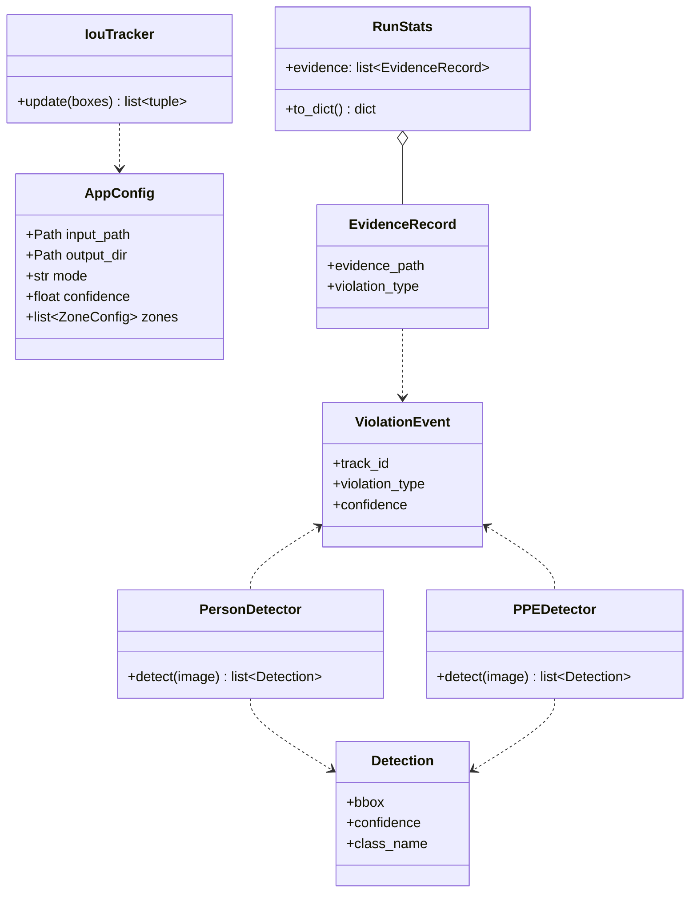

# Workflow

## Sequence Diagram — end-to-end run (video)

## Use Case Diagram

## Class / Component Diagram

No ER diagram is included — this project has no database or persistent
relational storage. Reports are stateless files written per run.
